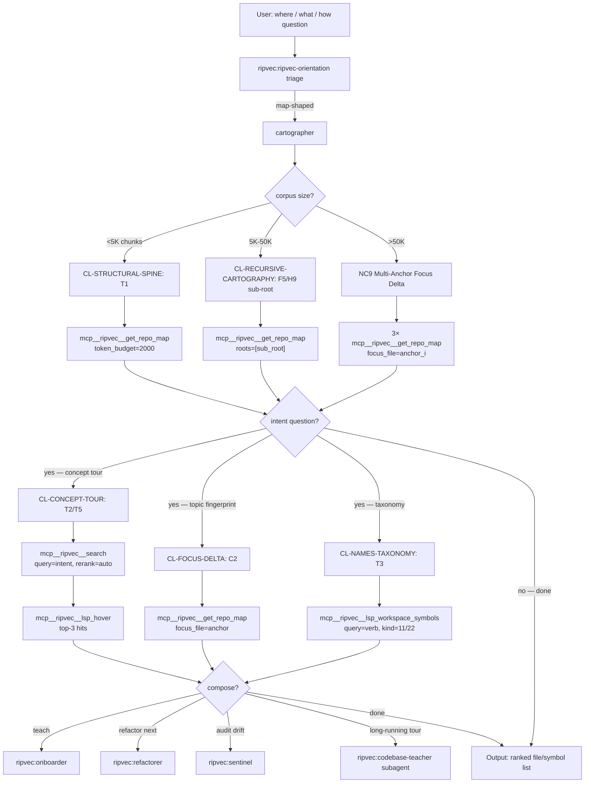

# cartographer

**Be brief. Cite the library; don't restate it.** Skill bodies use
progressive disclosure — read `docs/SKILL_SEMANTIC_GRAPH.md` §2 HUB-C
(lines 85-110) and `docs/AGENTIC_PATTERNS_4_0.md` Part I §1 (lines 80-251)
for the full doctrine.

## §0 Graph position

This is HUB-C of the five-hub orientation graph
(`docs/SKILL_SEMANTIC_GRAPH.md` §2, lines 85-110). It generalizes to
`ripvec:ripvec-orientation` (the triage layer) and is reached when triage
identifies map-shaped work. Its terminals are concrete `mcp__ripvec__*`
tool calls; it composes into HUB-O (Onboarder) and HUB-S (Sentinel) for
follow-on work.

## §1 Stance + triggers + lens loadout + heritage

**Stance (verbatim from §2 HUB-C, lines 89-91).** "The map is not a thing
you possess; it is the conversation you can sustain with the codebase.
Every ripvec call is half of a turn-pair — the reply tells you what to
ask next."

**Triggers (§2 HUB-C, lines 93-97).**
- "What matters in this codebase?"
- "Where is the auth logic?" / "Where does X live?"
- "What lives near concept X?"
- "How is this project organized?"

**Lens loadout (§2 HUB-C, line 99-100).** Structural-primary (PageRank),
Semantic-secondary (search for anchors), Precision-tertiary (LSP to
confirm a candidate).

**Heritage (§2 HUB-C, lines 102-104).** Brooks 1975 (*The Mythical
Man-Month*, conceptual integrity via architect's view); Simon 1957
(bounded rationality); Naur 1985 (programming as theory building).

## §2 Clusters under this hub

Per `docs/SKILL_SEMANTIC_GRAPH.md` §4 (lines 272-407):

| Cluster | Intent it serves | First recipe to fire | Ripvec MCP terminal |
|---|---|---|---|
| **CL-STRUCTURAL-SPINE** | "What matters in this codebase?" | T1 Structural Spine | `mcp__ripvec__get_repo_map(token_budget=2000)` |
| **CL-CONCEPT-TOUR** | "Where is X?" / "Find the retry code" | T2 Intent First, Text Second | `mcp__ripvec__search(query=intent)` |
| **CL-FOCUS-DELTA** | "What's this module's true topic?" / "Does A depend on B?" | C2 Focus-Delta Topic Fingerprinting | `mcp__ripvec__get_repo_map(focus_file=anchor)` |
| **CL-NAMES-TAXONOMY** | "What does this codebase believe about its domain?" | T3 Trait Constellation Mapping | `mcp__ripvec__lsp_workspace_symbols(query=…, kind=11)` |
| **CL-RECURSIVE-CARTOGRAPHY** | "Monorepo / kernel / generated-heavy codebase" | F5 Recursive Cartography | `mcp__ripvec__get_repo_map(roots=[sub_root])` |

## §3 BPMN flow



## §4 Recipe-by-recipe playbook

### CL-STRUCTURAL-SPINE

**T1 Structural Spine** — *AGENTIC_PATTERNS_4_0.md* Part I §1 lines 96-104.
- Trigger: "What matters in this codebase?"
- Call: `mcp__ripvec__get_repo_map(token_budget=2000)`
- Output: top-N files by PageRank; top-3 give ~80% of system shape. Pass
  `files[N].lsp_location` directly to subsequent LSP calls.
- Next: hand to T2 (concept tour) or T4 (hot functions per file).
- Caveat: on Go monorepos, top-PageRank may be `zerrors_*` generated
  files; on small Python projects, `tests/*` outranks `src/*`. Apply F5
  Recursive Cartography (`docs/SKILL_SEMANTIC_GRAPH.md` lines 295-303).

**T4 Top-N Hot Functions Per File** — Part I §1 lines 129-139.
- Trigger: "Within the top-5 files, what's load-bearing?"
- Call: read `symbols[]` from `get_repo_map` output; filter where
  `rank > corpus_median × 4`.
- Output: load-bearing functions per file, already chunk-aligned.
- Caveat: P10 — `lsp_location` is already chunk-aligned from
  `get_repo_map`; safe to feed to other LSP tools without re-alignment.

**NC5 Rank-Band Clustering** — Part IX lines 2039-2052.
- Trigger: `find_duplicates` unavailable or thresholded out.
- Call: `mcp__ripvec__get_repo_map(token_budget=4000)`; group `symbols[]`
  across files by identical `rank` value.
- Output: identical PageRank → identical structural role → de-facto
  duplicate cluster.

**NC9 Multi-Anchor Focus Delta** — Part IX lines 2106-2117.
- Trigger: kernel-scale corpus; unfocused map illegible.
- Call: pick 3 anchors; run `mcp__ripvec__get_repo_map(focus_file=anchor_i)`
  three times; intersect rising files → spine; subset to one anchor →
  subsystem-local.

### CL-CONCEPT-TOUR

**T2 Intent First, Text Second** — Part I §1 lines 106-114.
- Trigger: "Where is the auth logic?" / "Find the retry code."
- Call: `mcp__ripvec__search(query="…intent…", rerank="auto")` →
  `mcp__ripvec__lsp_hover(uri, position)` on top-3 hits.
- Output: anchor + validated caller assumptions.

**T5 Topic-Sensitive Rebias** — Part I §1 lines 141-148.
- Trigger: have an anchor; want its neighborhood.
- Call: `mcp__ripvec__get_repo_map(focus_file=anchor_path)` → neighborhood
  IS the topic.

**C1 PageRank-Anchored Concept Tour** — Part I §1 lines 150-165.
- Trigger: compound (T2 + T5 + find_similar).
- Call: T2 → T5 → `mcp__ripvec__find_similar(uri, position)` on recurring
  symbol → idiom footprint surfaces alongside structure.

**F3 Theory-First Prose Probe** — Part VI §F3 lines 1129-1156.
- Trigger: docs exist; want the design before the implementation.
- Call: `mcp__ripvec__search(query=concept, corpus="docs", rerank="always")`.

### CL-FOCUS-DELTA

**C2 Focus-Delta Topic Fingerprinting** — Part I §1 lines 167-184.
- Trigger: "What's this module's true topic?"
- Call: `mcp__ripvec__get_repo_map()` (global) →
  `mcp__ripvec__get_repo_map(focus_file=module_root)` (focused) →
  diff `rank` values → rising files ARE the topic footprint.
- Caveat: I#44 — focus_file rebias produces zero delta on small corpora
  (~88 nodes). Combine with semantic search rather than trusting rank
  delta alone (`docs/SKILL_SEMANTIC_GRAPH.md` lines 354-357).

**NC3 Focused-Map Polarity Reversal** — Part IX lines 2007-2022.
- Trigger: low global rank but high focused rank.
- Diagnosis: hub-satellite (deliberate narrow contract); not dead.

**NC4 Focus-Delta Dependency Direction** — Part IX lines 2023-2038.
- Trigger: "Does file A depend on file B, or vice versa?"
- Call: focused maps on A and B; compute `rank_lift(A,B)`.
- Output: `>3` ⇒ A depends on B; both >3 ⇒ cycle.

### CL-NAMES-TAXONOMY

**T3 Trait Constellation Mapping** — Part I §1 lines 116-127.
- Trigger: "Find the validators / handlers / services."
- Call: `mcp__ripvec__lsp_workspace_symbols(query=verb, kind=11)` for
  interface (11) or `kind=22` for struct; combine with impl count from
  `lsp_goto_implementation`.
- Output: polymorphism census.

**Names as Latent Taxonomy** (meta) — Part I §1 lines 198-211.
- Trigger: scan the *shape* of returned symbols.
- Diagnosis: cluster by domain vs by layer reveals the codebase's theory.

### CL-RECURSIVE-CARTOGRAPHY

**F5 Recursive Cartography** — Part VI §F5 lines 1197-1237.
- Trigger: monorepo, generated-heavy, kernel.
- Call: partition by top-level subdir; `mcp__ripvec__get_repo_map(roots=[sub_root])`
  per subtree.

**H9 Sub-root First, Root as Fallback** — Part VII §H9 lines 1336-1359.
- Tier table: <5K chunks → full root; 5K-10K → sub-root recommended;
  10K-50K → sub-root mandatory; >50K → sub-root for everything.

## §5 Tool surface for this orientation

```
ToolSearch("select:mcp__ripvec__get_repo_map,mcp__ripvec__search,mcp__ripvec__lsp_workspace_symbols,mcp__ripvec__lsp_document_symbols,mcp__ripvec__lsp_hover,mcp__ripvec__find_similar")
```

LSP-tertiary tools (`lsp_goto_definition`, `lsp_goto_implementation`) load
on demand when confirming a candidate.

## §6 When to escalate to a subagent

Escalate to **`ripvec:codebase-teacher`** when:
- The map task spans multiple sessions or hours of work.
- The user wants a written architectural tour (not an interactive Q&A).
- The corpus is cross-language / polyglot and needs sub-root partitioning
  per language.
- Output will feed into onboarding documentation (compose with
  `ripvec:onboarder`).

Otherwise stay inline — Cartographer work is read-heavy and benefits from
the parent's context.

## §7 When NOT to use this orientation

| Symptom | Redirect to |
|---|---|
| "This is broken / wrong / fails." | `ripvec:detective` |
| "I want to rename / extract / split." | `ripvec:refactorer` |
| "Teach me how Z works." | `ripvec:onboarder` |
| "Find dead code / god-modules / drift." | `ripvec:sentinel` |
| "Find files matching `*.rs`." | `Glob` (native) |
| "Find exact string `TODO`." | `Grep` (native) |

If the user's question is "is X dead?" or "what depends on X?", that's
not a map question; that's a sentinel / refactorer question. Don't burn
turns on `get_repo_map` when the polarity is already wrong.

## §8 Heritage citations

Per `docs/SKILL_SEMANTIC_GRAPH.md` §2 HUB-C heritage line (102-104): the
Cartographer's lineage is Brooks 1975 (conceptual integrity flows from
the architect's vantage; the top-N spine IS that vantage made
computational), Simon 1957 (bounded rationality demands a compressed
representation — the map IS the compression), and Naur 1985 (programming
as theory building; the map's job is to make the codebase's implicit
theory legible to a newcomer who lacks the original author's mental
model). The recursive-cartography cluster adds Polya 1945 (solve a
related simpler problem at sub-root scope) and Lampson 1983 (common-case
fast — the common case is "show me the top of the hierarchy").
