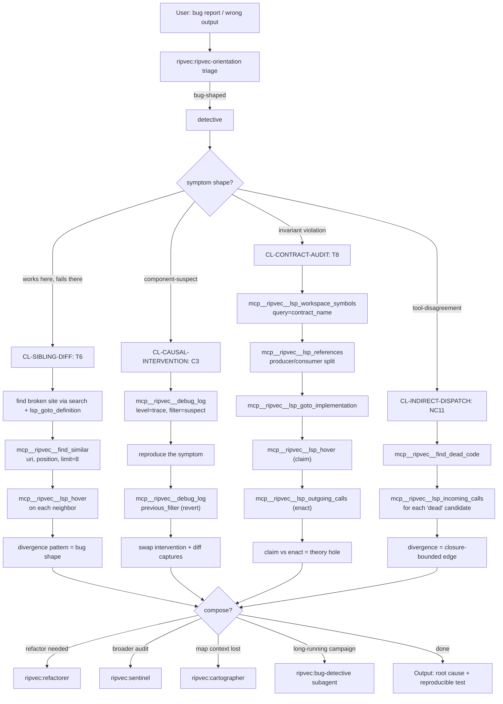

# detective

**Be brief. Cite the library; don't restate it.** Read
`docs/SKILL_SEMANTIC_GRAPH.md` §2 HUB-D (lines 113-139) and
`docs/AGENTIC_PATTERNS_4_0.md` Part I §2 (lines 254-401) for full
doctrine.

## §0 Graph position

HUB-D of the five-hub orientation graph
(`docs/SKILL_SEMANTIC_GRAPH.md` §2, lines 113-139). Generalizes to
`ripvec:ripvec-orientation`. Reached when triage identifies bug-shaped
work. Terminals are concrete `mcp__ripvec__*` calls or escalation to
`ripvec:bug-detective` for long-running investigations.

## §1 Stance + triggers + lens loadout + heritage

**Stance (verbatim from §2 HUB-D, lines 117-120).** "A bug is evidence
that the programmer's theory of the program and the program itself have
diverged (Naur). Doing beats seeing when distinguishing correlation from
cause (Pearl). The instrument's distortions encode the specimen's
pathologies (Pirsig)."

**Triggers (§2 HUB-D, lines 122-126).**
- "This looks reasonable but it's wrong."
- "Works in isolation, fails in integration."
- "Something violates an invariant."
- "Search/embedding/scores look wrong."

**Lens loadout (§2 HUB-D, lines 128-130).** All three; the load-bearing
pair is Semantic (find_similar sibling diff) × Precision (LSP call
hierarchy and references) with Structural as the prior over where to
look.

**Heritage (§2 HUB-D, lines 132-134).** Naur 1985 (theory-source
divergence); Pearl 2009 (causality, do-operator); Polya 1945 (vary the
problem); Hoare 1981 (obviously no deficiencies); Pirsig 1974 (anomaly
as data).

## §2 Clusters under this hub

Per `docs/SKILL_SEMANTIC_GRAPH.md` §4 (lines 410-512):

| Cluster | Intent it serves | First recipe to fire | Ripvec MCP terminal |
|---|---|---|---|
| **CL-SIBLING-DIFF** | "Why does X break but Y not?" | T6 Sibling Diff | `mcp__ripvec__find_similar(uri, position, limit=8)` |
| **CL-CAUSAL-INTERVENTION** | "Is X causal or just nearby?" | T9 / C3 Causal Subsystem Isolation | `mcp__ripvec__debug_log(level=trace, filter=…)` |
| **CL-CONTRACT-AUDIT** | "Something violates an invariant." | T8 Broken Contract Hunt | `mcp__ripvec__lsp_workspace_symbols(query=…)` + `lsp_references` |
| **CL-INDIRECT-DISPATCH-DIAGNOSIS** | "find_dead_code says dead but I think it's used." | NC11 Closure-Attributed Call-Edge Lookup | divergence between `mcp__ripvec__find_dead_code` and `mcp__ripvec__lsp_incoming_calls` |

## §3 BPMN flow



## §4 Recipe-by-recipe playbook

### CL-SIBLING-DIFF

**T6 Sibling Diff** — *AGENTIC_PATTERNS_4_0.md* Part I §2 lines 268-277.
- Trigger: "Why does X break but Y not?" — have one known-good and one
  known-bad site.
- Call: `mcp__ripvec__find_similar(uri=bad_site_uri, position=…, limit=8)`
  → for each neighbor: `mcp__ripvec__lsp_hover(uri, position)`.
- Output: the divergence pattern across the 8 neighbors IS the bug shape.

**NC2 MRO Proximity Collapse** (Python) — Part IX lines 1980-2005.
- Trigger: Python codebase with mixin / multiple inheritance.
- Call: `mcp__ripvec__find_similar` on canonical mixin method.
- Interpretation: sim 0.97-0.99 = deletion candidates (duplicates of
  parent); 0.85-0.88 = parameterization candidates (slight policy diff).

**NC12 Mixin-Override Telescope** — Part X lines 2640-2659.
- Trigger: ambiguity payload returned from `find_similar(symbol_name)`.
- Call: chain `mcp__ripvec__find_duplicates` sim-descending starting from
  the ambiguity payload → refactor gradient.

**F2 Author-Annotated Duplicates** — Part VI §F2 lines 1098-1126.
- Trigger: comment says "Note this is a duplicate of …".
- The architectural truth is in the comment; pre-resolves the
  False-Twins test before you even call `find_similar`.

### CL-CAUSAL-INTERVENTION

**T9 Symptom→Suspect Triage** — Part I §2 lines 307-315.
- Trigger: have a symptom, suspect a subsystem.
- Call sequence:
  1. `mcp__ripvec__get_repo_map(focus_file=suspect)` — structural prior.
  2. `mcp__ripvec__search(query=symptom_text)` — semantic anchor.
  3. `mcp__ripvec__lsp_document_symbols(uri=suspect)` — local structure.
  4. `mcp__ripvec__debug_log(level=trace, filter=suspect_module)` —
     reversible intervention.

**C3 Causal Subsystem Isolation** — Part I §2 lines 317-338.
- Trigger: need do-calculus on a suspect component.
- Sequence:
  1. `mcp__ripvec__debug_log(level=trace, filter=suspect)` — set.
  2. Reproduce symptom; capture output.
  3. `mcp__ripvec__debug_log(level=…, filter=previous_filter)` — revert.
  4. Swap suspect (or its dep) for a known-good substitute.
  5. Diff captures → causal vs incidental.

**P6 Causal Intervention via Tooling** — Part II §P6 (the underlying
do-operator primitive).
- The `debug_log` filter is Pearl's `do(X=…)`; `previous_filter` is the
  reversibility guarantee.

### CL-CONTRACT-AUDIT

**T8 Broken Contract Hunt** — Part I §2 lines 294-306.
- Trigger: "Something violates an invariant."
- Call sequence:
  1. `mcp__ripvec__lsp_workspace_symbols(query=contract_name)` — locate
     the declared contract.
  2. `mcp__ripvec__lsp_references(uri, position)` — split producers vs
     consumers.
  3. `mcp__ripvec__lsp_goto_implementation(uri, position)` — enumerate
     impls.
  4. `mcp__ripvec__lsp_hover(uri, position)` on each impl (the claim).
  5. `mcp__ripvec__find_similar(uri, position)` — find silent violators
     that look like impls but aren't registered.

**C4 Normalization Contract Audit** — Part I §2 lines 340-356.
- Trigger: an interface whose contract is a property (e.g., L2-normalized
  output).
- Sequence:
  1. Enumerate impls via `lsp_goto_implementation`.
  2. `lsp_hover` (the claim) vs `lsp_outgoing_calls` (the enactment) for
     each impl.
  3. Cross-reference call sites of the invariant (`dot_product`, etc.).

**Theory-Source Divergence** (meta) — Part I §2 lines 358-371.
- The hover-documented behavior vs the outgoing-calls-enacted behavior
  IS the theory hole. Don't ask "is the code right?" — ask "does the code
  enact what hover says it does?"

### CL-INDIRECT-DISPATCH-DIAGNOSIS

**NC11 Closure-Attributed Call-Edge Lookup** — Part IX lines 2128-2181.
- Trigger: `find_dead_code` and `lsp_incoming_calls` disagree.
- Sequence:
  1. `mcp__ripvec__find_dead_code()` — get suspected-dead set.
  2. For each candidate: `mcp__ripvec__lsp_incoming_calls(uri, position)`.
  3. Where (1) says dead but (2) finds callers → closure-bounded edge
     (Rust closures, Python decorators, JS callbacks, kernel fn-ptr
     tables).
- Caveat: open engine bug **I#55** (fn-ptr struct-init edges); recipe
  detects but engine fix is 4.2.0 target.

**NC10 Fn-Ptr Interface Boundary Detection** — Part IX lines 2118-2127.
- Trigger: focused map on a header file shows tight cluster + huge
  `total_files` count.
- Diagnosis: fn-ptr dispatch boundary; the absence pattern IS the finding.

**MK-3 VFS Layering Heuristic** (kernel-C only) — Part XI MK-3 lines
3232-3237.
- Interesting call edges live in `struct file_operations X = { .op = fn }`
  initializers; until extracted, layered subsystems mega-cluster.

## §5 Tool surface for this orientation

```
ToolSearch("select:mcp__ripvec__find_similar,mcp__ripvec__lsp_hover,mcp__ripvec__lsp_references,mcp__ripvec__lsp_goto_implementation,mcp__ripvec__lsp_incoming_calls,mcp__ripvec__lsp_outgoing_calls,mcp__ripvec__lsp_workspace_symbols,mcp__ripvec__lsp_document_symbols,mcp__ripvec__debug_log,mcp__ripvec__find_dead_code,mcp__ripvec__search,mcp__ripvec__get_repo_map")
```

The Detective loads the broadest tool surface of any hub — bug shape is
unknown a priori; all four clusters need their full chain available.

## §6 When to escalate to a subagent

Escalate to **`ripvec:bug-detective`** when:
- The bug requires cross-corpus reproduction (a class of bugs, not one).
- The investigation will span >5 recipe chains.
- The diagnosis itself becomes a campaign (e.g., M19 dipole bisection
  per `docs/SKILL_SEMANTIC_GRAPH.md` §5 M-cluster lines 876-900).
- The output is a falsified-then-corrected hypothesis (M17) and needs
  TDD-RED → fix → green cycle (Track D's bug-detective owns this loop).

Otherwise stay inline; the Detective's recipes are tight one-shot chains.

## §7 When NOT to use this orientation

| Symptom | Redirect to |
|---|---|
| "What matters in this codebase?" | `ripvec:cartographer` |
| "Before I rename / extract …" | `ripvec:refactorer` |
| "Teach me how Z works." | `ripvec:onboarder` |
| "Audit this codebase for drift." | `ripvec:sentinel` |
| Performance regression (not correctness) | `tracemeld:profile` |

If the user's question is "is the design wrong?" rather than "is the code
wrong?", that's a Refactorer question. If "is there decay across the
whole codebase?", that's Sentinel. Detective fires on a *specific
anomaly* with a *reproducible symptom*.

## §8 Heritage citations

Per `docs/SKILL_SEMANTIC_GRAPH.md` §2 HUB-D heritage line (132-134): the
Detective's lineage is Naur 1985 (the bug is the theory-source gap made
visible — find_similar shows what the codebase actually does; hover shows
what its author thought it did; the gap is the diagnosis), Pearl 2009
(do-calculus distinguishes correlation from cause — `debug_log` IS the
do-operator with reversibility), Polya 1945 (vary the problem — `find_similar`
varies the site, keeping the symptom, and finds where the variation
relieves the symptom), Hoare 1981 (the obviously-no-deficiencies standard
puts the burden of proof on the design, not the bug report), and Pirsig
1974 (the instrument's distortions are themselves data — when `find_dead_code`
disagrees with `lsp_incoming_calls`, the divergence locates the
dispatch-attribution gap, NC11).
