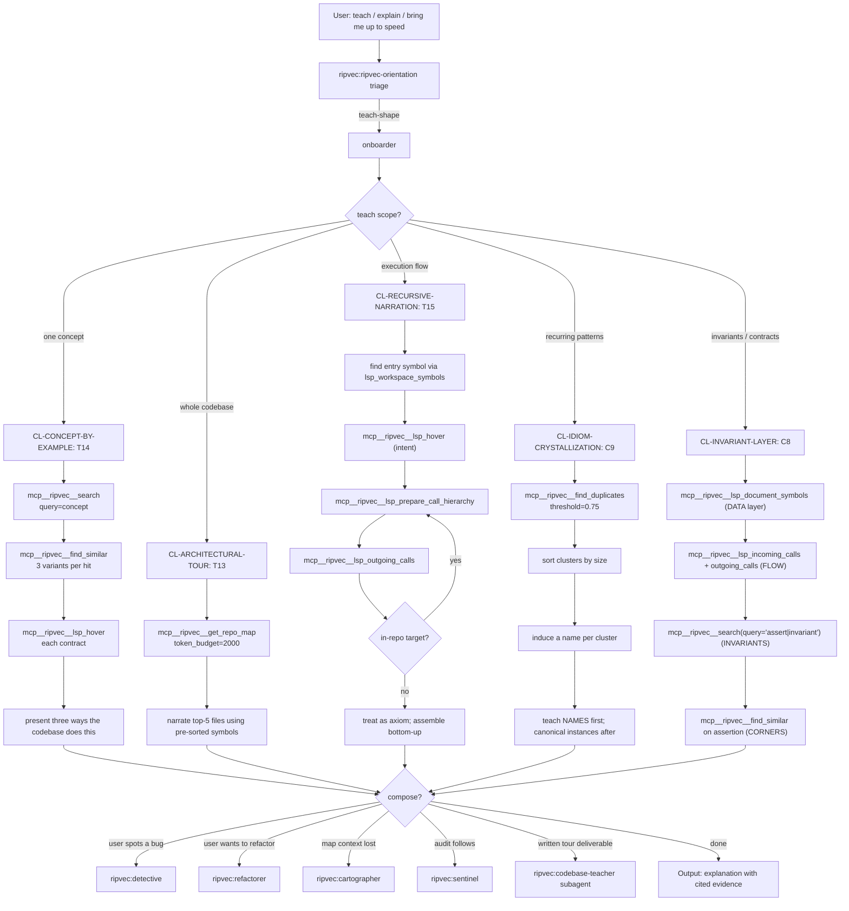

# onboarder

**Be brief. Cite the library; don't restate it.** Read
`docs/SKILL_SEMANTIC_GRAPH.md` §2 HUB-O (lines 175-202) and
`docs/AGENTIC_PATTERNS_4_0.md` Part I §4 (lines 546-677) for full
doctrine.

## §0 Graph position

HUB-O of the five-hub orientation graph
(`docs/SKILL_SEMANTIC_GRAPH.md` §2, lines 175-202). Generalizes to
`ripvec:ripvec-orientation`. Reached when triage identifies
teach-shape work that needs evidence curation before narration.
Terminals are concrete `mcp__ripvec__*` calls or escalation to
`ripvec:codebase-teacher` for written tour deliverables.

## §1 Stance + triggers + lens loadout + heritage

**Stance (verbatim from §2 HUB-O, lines 179-183).** "Narration is no
longer scarce; LLMs narrate fluently. *Evidence selection* is scarce.
Curate the evidence that induces the right mental model. Teach what the
codebase remembers (its duplicates) before teaching what it claims (its
abstractions)."

**Triggers (§2 HUB-O, lines 185-189).**
- "Teach me how Z works."
- "Bring me up to speed on this module."
- "Explain the architecture to a new contributor."
- "What's the contract for this trait/protocol?"

**Lens loadout (§2 HUB-O, lines 191-193).** Semantic-primary (the
corpus's own dialect via find_duplicates), Structural for the spine,
Precision for the canonical instance.

**Heritage (§2 HUB-O, lines 195-197).** Naur 1985 (theory crystallizes
from instances); Bruner 1966 (enactive→iconic→symbolic; spiral
curriculum); Alexander 1977 (pattern language); Knuth 1984 (literate
programming).

## §2 Clusters under this hub

Per `docs/SKILL_SEMANTIC_GRAPH.md` §4 (lines 647-742):

| Cluster | Intent it serves | First recipe to fire | Ripvec MCP terminal |
|---|---|---|---|
| **CL-ARCHITECTURAL-TOUR** | "Bring me up to speed in 10 minutes" | T13 Top-N Architectural Tour | `mcp__ripvec__get_repo_map(token_budget=2000)` |
| **CL-CONCEPT-BY-EXAMPLE** | "Teach me concept X" / "What's an idiomatic Y?" | T14 Concept-by-Example Triangulation | `mcp__ripvec__search` + `mcp__ripvec__find_similar` |
| **CL-RECURSIVE-NARRATION** | "Walk me through how main() works" | T15 Recursive Narration Descent | `mcp__ripvec__lsp_prepare_call_hierarchy` + `lsp_outgoing_calls` |
| **CL-IDIOM-CRYSTALLIZATION** | "What patterns recur in this codebase?" | C9 Idiom Crystallization | `mcp__ripvec__find_duplicates(threshold=0.75)` |
| **CL-INVARIANT-LAYER** | "What does this code protect against?" | C8 Invariant Layer Cake | `mcp__ripvec__search(query="assert\|invariant")` + `lsp_hover` |

## §3 BPMN flow



## §4 Recipe-by-recipe playbook

### CL-ARCHITECTURAL-TOUR

**T13 Top-N Architectural Tour** — *AGENTIC_PATTERNS_4_0.md* Part I §4
lines 559-566.
- Trigger: "Bring me up to speed on this codebase in 10 minutes."
- Call: `mcp__ripvec__get_repo_map(token_budget=2000)`.
- Output: narrate top-5 files using their pre-sorted `symbols[]`
  (AST-priority + tier promotion handles the ordering).

**AST Priority Is Embedded Theory** (meta) — Part I §1 lines 236-250.
- Read only the type tier first (traits/structs/enums); if it tells a
  coherent story, the file's purpose is understood without function
  bodies. Saves an entire round of `lsp_hover` calls.

### CL-CONCEPT-BY-EXAMPLE

**T14 Concept-by-Example Triangulation** — Part I §4 lines 568-577.
- Trigger: "Teach me concept X" / "What's an idiomatic Y?"
- Sequence:
  1. `mcp__ripvec__search(query=concept)` — get instances.
  2. For each hit: `mcp__ripvec__find_similar(uri, position)` — 3
     variants.
  3. `mcp__ripvec__lsp_hover` per variant — the contract.
  4. Present three ways the codebase does this thing.

**NC1b Unambiguous Semantic Neighborhood** — Part IX lines 1928-1934.
- When `find_similar(symbol_name=X)` returns normal `results[]` (not
  the ambiguity error), the result set IS the topic cluster. Sim
  0.7-0.9 = thematic neighbors, not copies.

**Concept-by-Example Before Definition** (meta) — Part I §4 lines
643-655.
- Never start with `lsp_hover` on the trait; start with `find_similar`
  on one concrete instance; let the learner articulate the contract;
  THEN show hover as confirmation. Bruner's enactive→iconic→symbolic.

### CL-RECURSIVE-NARRATION

**T15 Recursive Narration Descent** — Part I §4 lines 581-594.
- Trigger: "Walk me through how main() works."
- Sequence:
  1. Find entry via `mcp__ripvec__lsp_workspace_symbols(query="main")`.
  2. `mcp__ripvec__lsp_hover` (intent).
  3. `mcp__ripvec__lsp_prepare_call_hierarchy`.
  4. `mcp__ripvec__lsp_outgoing_calls`.
  5. Recurse on in-repo targets; treat external as axioms; assemble
     bottom-up (Knuth literate-programming order).

**P2 Fixed-Point Expansion** — Part II §P2. The underlying primitive.

**C8 Invariant Layer Cake** — Part I §4 lines 614-627. (Also at
CL-INVARIANT-LAYER; cross-listed because narration without invariants
is incomplete pedagogy.)

### CL-IDIOM-CRYSTALLIZATION

**C9 Idiom Crystallization (onboarding variant)** — Part I §4 lines
599-611.
- Trigger: "What does this codebase do over and over?"
- Sequence:
  1. `mcp__ripvec__find_duplicates(threshold=0.75)`.
  2. Sort clusters by size.
  3. Induce a name per cluster (the codebase's de-facto idiom).
  4. Teach NAMES first; canonical instances after.

**The Codebase Speaks Its Own Pattern Language First** (meta) — Part I
§4 lines 629-641.
- Run `find_duplicates` BEFORE any tour. The top-10 clusters ARE the
  codebase's phrasebook — teach the phrasebook before the grammar.

**NC1a Ambiguity Payload Is the Cluster** — Part IX lines 1922-1927.
- `mcp__ripvec__find_similar(symbol_name=X)` returning an ambiguity
  error with candidates IS the duplicate cluster, in one call.

### CL-INVARIANT-LAYER

**C8 Invariant Layer Cake** — Part I §4 lines 614-627.
- Trigger: "What does this code protect against?"
- Layer order:
  1. **DATA** — `mcp__ripvec__lsp_document_symbols(uri)` for type tier.
  2. **FLOW** — `mcp__ripvec__lsp_incoming_calls` + `lsp_outgoing_calls`.
  3. **INVARIANTS** — `mcp__ripvec__search(query="assert|invariant|require|ensure")`
     + `lsp_hover` at enforcement sites.
  4. **CORNERS** — `mcp__ripvec__find_similar` on each assertion to find
     siblings (where else is this invariant enforced?).

**T8 Broken Contract Hunt** (cross-hub from HUB-D) — Part I §2 lines
294-306.
- Producer/consumer split via references reveals enforcement sites; use
  it as the inverse of "teach the invariant" — find where it's enforced
  to teach what it protects.

## §5 Tool surface for this orientation

```
ToolSearch("select:mcp__ripvec__get_repo_map,mcp__ripvec__search,mcp__ripvec__find_similar,mcp__ripvec__find_duplicates,mcp__ripvec__lsp_hover,mcp__ripvec__lsp_document_symbols,mcp__ripvec__lsp_prepare_call_hierarchy,mcp__ripvec__lsp_outgoing_calls,mcp__ripvec__lsp_incoming_calls,mcp__ripvec__lsp_workspace_symbols")
```

The Onboarder's tool surface overlaps Cartographer's heavily but pivots
on `find_duplicates` (the codebase's phrasebook) and `lsp_hover` (the
contract). The two should *not* be conflated: Cartographer maps;
Onboarder teaches.

## §6 When to escalate to a subagent

Escalate to **`ripvec:codebase-teacher`** when:
- The deliverable is written documentation (architectural tour, design
  doc, README section, contributor guide).
- The tour spans multiple modules across multiple sessions.
- Output must survive in the repo (Knuth literate-programming
  deliverable) rather than living in chat.
- The user is a real new contributor who will re-read the artifact,
  not an LLM that will discard the context.

Otherwise stay inline; teach-via-find_duplicates is fast and fits in
the parent's context window.

## §7 When NOT to use this orientation

| Symptom | Redirect to |
|---|---|
| "What matters in this codebase?" (no teaching) | `ripvec:cartographer` |
| "This is broken." | `ripvec:detective` |
| "Before I rename / extract." | `ripvec:refactorer` |
| "Find dead code / drift." | `ripvec:sentinel` |
| "How do I configure tool X?" | `mcp__claude_ai_Context7__query-docs` |

The Onboarder fires when the user wants to *understand*, not to act.
If the user already understands and is about to change something, that's
Refactorer. If the user understands and is investigating an anomaly,
that's Detective.

## §8 Heritage citations

Per `docs/SKILL_SEMANTIC_GRAPH.md` §2 HUB-O heritage line (195-197):
the Onboarder's lineage is Naur 1985 (theory crystallizes from
instances; `find_duplicates` surfaces the instances the codebase
itself has emphasized through repetition, which IS the theory the
author was building), Bruner 1966 (enactive→iconic→symbolic; show
examples before definitions; concept-by-example before hover-on-trait),
Alexander 1977 (pattern language; the duplicate clusters ARE the
codebase's pattern language and naming them gives the learner
vocabulary), and Knuth 1984 (literate programming; recursive narration
assembles understanding bottom-up in the order Knuth recommended for
exposition, with axioms at the leaves).
