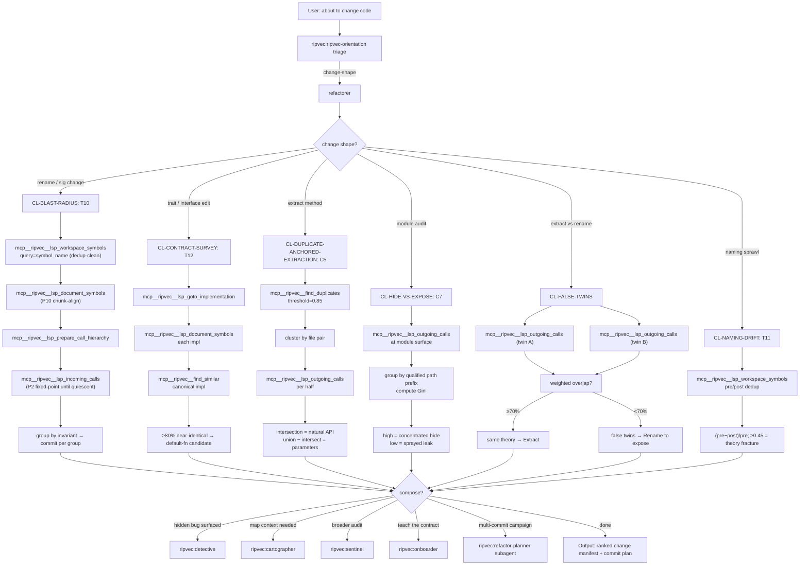

# refactorer

**Be brief. Cite the library; don't restate it.** Read
`docs/SKILL_SEMANTIC_GRAPH.md` §2 HUB-R (lines 143-171) and
`docs/AGENTIC_PATTERNS_4_0.md` Part I §3 (lines 403-544) for full
doctrine.

## §0 Graph position

HUB-R of the five-hub orientation graph
(`docs/SKILL_SEMANTIC_GRAPH.md` §2, lines 143-171). Generalizes to
`ripvec:ripvec-orientation`. Reached when triage identifies
change-shape work that needs blast-radius / contract / hide-vs-expose
evidence before action. Terminals are concrete `mcp__ripvec__*` calls
or escalation to `ripvec:refactor-planner` for multi-commit campaigns.

## §1 Stance + triggers + lens loadout + heritage

**Stance (verbatim from §2 HUB-R, lines 147-151).** "Mechanical
refactors are cheap in the AI-augmented era; the bottleneck is judgment
about *when*, *where*, and *what shape*. Ripvec turns judgment into
evidence: blast radius becomes a number, hide-vs-expose acquires a
metric, refactor sizing becomes a query."

**Triggers (§2 HUB-R, lines 153-157).**
- "Before I rename X..."
- "Before I edit this trait..."
- "Should I extract / inline / split this?"
- "What's the blast radius?"
- "Are these two functions the same or just look the same?"

**Lens loadout (§2 HUB-R, lines 159-161).** Precision-primary (call
hierarchy, references for blast radius), Semantic-secondary
(find_similar for sibling discovery), Structural to gauge centrality
of the target.

**Heritage (§2 HUB-R, lines 163-165).** Cunningham 2005 (make the
change easy); Beck 2004 (small steps); Fowler 1999 (Refactoring
catalog); Parnas 1972 (information hiding); Hickey 2011 (Simple Made
Easy; complecting/decomplecting).

## §2 Clusters under this hub

Per `docs/SKILL_SEMANTIC_GRAPH.md` §4 (lines 515-644):

| Cluster | Intent it serves | First recipe to fire | Ripvec MCP terminal |
|---|---|---|---|
| **CL-BLAST-RADIUS** | "Before I rename X — who breaks?" | T10 Blast-Radius Manifest | `mcp__ripvec__lsp_prepare_call_hierarchy` + `lsp_incoming_calls` (fixed-point) |
| **CL-CONTRACT-SURVEY** | "Before I edit this trait — what do impls assume?" | T12 Impl Survey | `mcp__ripvec__lsp_goto_implementation` + `lsp_document_symbols` per impl |
| **CL-DUPLICATE-ANCHORED-EXTRACTION** | "I see repeating code. Is extraction safe?" | C5 Duplicate-Anchored Extraction | `mcp__ripvec__find_duplicates` + `lsp_outgoing_calls` intersection |
| **CL-HIDE-VS-EXPOSE** | "Is this module a leaky abstraction?" | C7 Gini-Coefficient Hide Metric | `mcp__ripvec__lsp_outgoing_calls` grouped by qualified-path prefix |
| **CL-FALSE-TWINS** | "These two look identical. Extract Method?" | False-Twins Test | `mcp__ripvec__lsp_outgoing_calls` × 2 + intersection |
| **CL-NAMING-DRIFT** | "Six `process_*` functions, all different meanings?" | T11 Drift Index Audit | `mcp__ripvec__lsp_workspace_symbols(query, dedup_clean=true)` |

## §3 BPMN flow



## §4 Recipe-by-recipe playbook

### CL-BLAST-RADIUS

**T10 Blast-Radius Manifest Before Rename** — *AGENTIC_PATTERNS_4_0.md*
Part I §3 lines 415-426.
- Trigger: "Before I rename / delete / change the signature of X..."
- Sequence:
  1. `mcp__ripvec__lsp_workspace_symbols(query=symbol_name)` (dedup-clean).
  2. `mcp__ripvec__lsp_document_symbols(uri)` — P10 chunk-align.
  3. `mcp__ripvec__lsp_prepare_call_hierarchy(uri, position)`.
  4. `mcp__ripvec__lsp_incoming_calls(call_item)` — recurse to fixed point.
  5. Group callers by invariant (same-test, same-config, same-module);
     commit per group (Beck small steps).

**P2 Fixed-Point Expansion** — Part II §P2.
- The underlying primitive: recurse `lsp_references` / `lsp_incoming_calls`
  until the result set stops growing. Load-bearing for blast radius and
  dead-code diagnosis.

**P10 Chunk-Align Before Cross-Tool** — Part VIII NC-list.
- Route any `lsp_workspace_symbols` location through
  `lsp_document_symbols` before feeding to `prepare_call_hierarchy` —
  otherwise empty/wrong results.

### CL-CONTRACT-SURVEY

**T12 Impl Survey Before Trait Edit** — Part I §3 lines 437-446.
- Trigger: "Before I edit this trait / interface / protocol method..."
- Sequence:
  1. `mcp__ripvec__lsp_goto_implementation(uri, position)` — enumerate.
  2. `mcp__ripvec__lsp_document_symbols(uri)` for each impl.
  3. `mcp__ripvec__find_similar(uri, position)` on canonical impl.
  4. If ≥80% near-identical → default-fn extraction candidate.

**P7 Trait Constellation Survey** — Part II §P7.
- impl-count + ref-count → trichotomy: orphan (0,0) → delete;
  vestigial (1,_) → inline; load-bearing (≥2,_) → keep.

### CL-DUPLICATE-ANCHORED-EXTRACTION

**C5 Duplicate-Anchored Extraction** — Part I §3 lines 448-460.
- Trigger: "I see repeating code; is extraction safe?"
- Sequence:
  1. `mcp__ripvec__find_duplicates(threshold=0.85)`.
  2. Cluster results by file pair.
  3. `mcp__ripvec__lsp_outgoing_calls` per half.
  4. Intersection = natural API for the extracted fn; union − intersect
     = parameters.

**C6 Prerequisite-Cleanup Sizing** — Part I §3 lines 462-476.
- Trigger: "How big is this refactor really?"
- Signature: `(incoming, outgoing, strong-similar, weak-similar)`.
- Rule of thumb: `(3,4,0,1)` = 30-min; `(47,12,2,6)` = multi-commit.

**NC14 NC7 Multi-Site Discovery** — Part X lines 2676-2685.
- Trigger: small corpus; want all spec↔impl pairs in one call.
- Call: `mcp__ripvec__find_duplicates(threshold=0.85, corpus="all")`.

### CL-HIDE-VS-EXPOSE

**C7 Gini-Coefficient Hide Metric** — Part I §3 lines 498-519.
- Trigger: "Is this module a leaky abstraction?"
- Sequence:
  1. `mcp__ripvec__lsp_outgoing_calls(uri, position)` at module surface.
  2. Group by qualified path prefix (e.g., `std::`, `crate::core::`).
  3. Compute Gini coefficient.
  4. High Gini = concentrated hide (good); low = sprayed leak (refactor).

**H6′ Fill-Graph Dual** — Part IX lines 1872-1885.
- Trigger: central abstraction is a fn-ptr table; outgoing_calls stops
  at the indirect jump.
- Augment with `mcp__ripvec__find_similar(symbol_name=struct_name)` to
  recover the fill set.

**Hide-Is-Dual Import-Grep Fallback** — Part VII lines 1448-1468.
- Trigger: `outgoing_calls` returns empty (Python; permission-denied).
- Fallback: parse `from X import` lines as outgoing surrogate; sprayed
  across 6+ subsystems = leaky.

### CL-FALSE-TWINS

**False-Twins Test** — Part I §3 lines 478-496.
- Trigger: "These two look identical. Extract or Rename?"
- Sequence:
  1. `mcp__ripvec__lsp_outgoing_calls` on twin A.
  2. `mcp__ripvec__lsp_outgoing_calls` on twin B.
  3. Weighted overlap ≥70% → same theory → Extract Method.
  4. Disjoint → false twins → Rename one to expose the distinction.

**F2 Author-Annotated Duplicates** (cross-hub) — Part VI §F2.
- If a doc/comment pre-resolves the decision, honor it; skip the test.

### CL-NAMING-DRIFT

**T11 Drift Index Audit** — Part I §3 lines 428-435; calibration Part
VIII lines 1594-1608.
- Trigger: "Are there N `process_*` that all mean different things?"
- Compute: `(pre_dedup_count − post_dedup_count) / pre_dedup_count`.
- Threshold: ≥0.45 (per-language calibration) = theory fracture.
- Caveat: original 0.15 threshold was falsified (`docs/SKILL_SEMANTIC_GRAPH.md`
  §4 CL-NAMING-DRIFT lines 637-643). Use 0.45. If `drift_meaningful=false`,
  treat that as the answer (I#63 telemetry-axis-bug).

**P5 Names as Folk Taxonomy** — Part II §P5.
- The underlying primitive.

**Refactor as Theory Clarification** (meta) — Part I §3 lines 521-543.
- Semantic ∩ symbolic disagreement = drift direction:
  - Semantic finds names symbolic misses → rename.
  - Symbolic finds N names where semantic finds 1 concept → collapse
    synonyms.

## §5 Tool surface for this orientation

```
ToolSearch("select:mcp__ripvec__lsp_workspace_symbols,mcp__ripvec__lsp_document_symbols,mcp__ripvec__lsp_prepare_call_hierarchy,mcp__ripvec__lsp_incoming_calls,mcp__ripvec__lsp_outgoing_calls,mcp__ripvec__lsp_goto_implementation,mcp__ripvec__lsp_references,mcp__ripvec__find_similar,mcp__ripvec__find_duplicates,mcp__ripvec__search")
```

The Refactorer leans hardest on the LSP precision tools — every recipe
needs `lsp_*` chains. `find_similar` and `find_duplicates` cover the
sibling/extraction clusters.

## §6 When to escalate to a subagent

Escalate to **`ripvec:refactor-planner`** when:
- Blast radius exceeds ~20 call sites or spans >5 files.
- Refactor is multi-commit (Beck small steps require sequenced commits
  with intermediate green tests).
- Multiple recipes compose (e.g., T10 + T12 + C5 in one campaign).
- C6 sizing returns `(47,12,2,6)`-class numbers — multi-commit cost.
- Output must be a written plan a human reviews before execution.

Otherwise stay inline; single-recipe refactor judgments fit in one
parent turn.

## §7 When NOT to use this orientation

| Symptom | Redirect to |
|---|---|
| "What matters in this codebase?" (no change planned) | `ripvec:cartographer` |
| "Is this broken?" (correctness, not shape) | `ripvec:detective` |
| "Teach me what this trait is for." | `ripvec:onboarder` |
| "Audit decay across the whole codebase." | `ripvec:sentinel` |
| "Is X dead?" (lifecycle, not change) | `ripvec:sentinel` CL-DEAD-CODE-SWEEP |

The Refactorer fires when the user is about to *make a change* and needs
evidence first. If no change is planned, the right hub is Cartographer
(map) or Onboarder (teach).

## §8 Heritage citations

Per `docs/SKILL_SEMANTIC_GRAPH.md` §2 HUB-R heritage line (163-165): the
Refactorer's lineage is Cunningham 2005 ("make the change easy first;
then make the easy change" — the blast-radius manifest IS the easy-first
investment), Beck 2004 (small steps; the manifest commits per-invariant
group rather than one big-bang rename), Fowler 1999 (the Refactoring
catalog; recipes here mechanize Extract Method, Rename, and Move via
LSP), Parnas 1972 (information hiding; C7 Gini metric quantifies what
Parnas defined qualitatively — judge a module by what it hides), and
Hickey 2011 (complecting/decomplecting; the False-Twins Test
distinguishes incidental sameness from essential sameness, which is
exactly the decomplect/extract decision).
