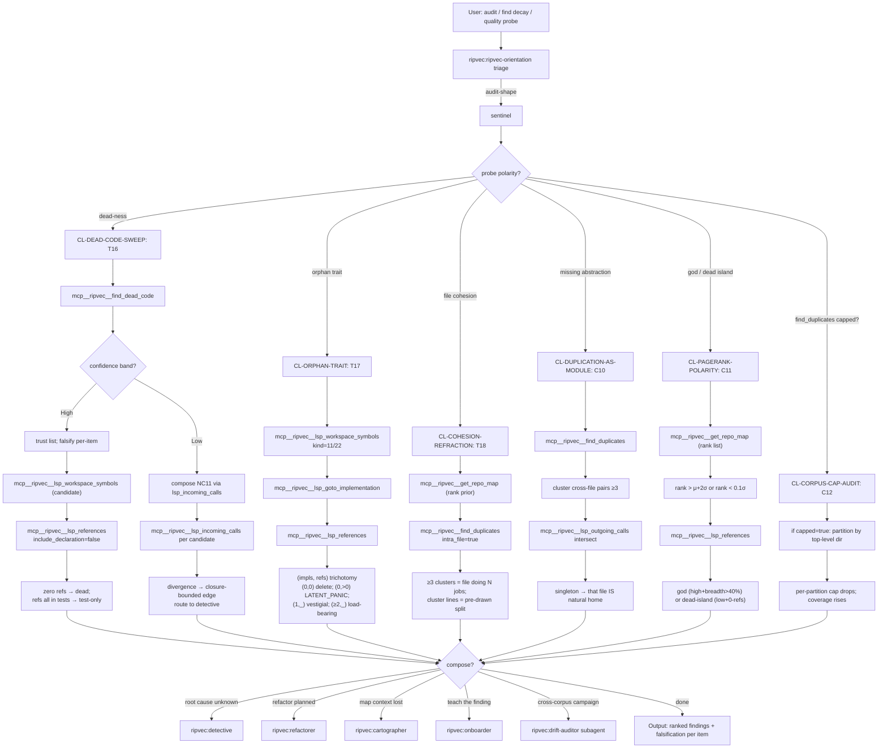

# sentinel

**Be brief. Cite the library; don't restate it.** Read
`docs/SKILL_SEMANTIC_GRAPH.md` §2 HUB-S (lines 205-233) and
`docs/AGENTIC_PATTERNS_4_0.md` Part I §5 (lines 679-833) for full
doctrine.

## §0 Graph position

HUB-S of the five-hub orientation graph
(`docs/SKILL_SEMANTIC_GRAPH.md` §2, lines 205-233). Generalizes to
`ripvec:ripvec-orientation`. Reached when triage identifies audit-shape
work where each mode of decay leaves a different ripvec-detectable
fingerprint. Terminals are concrete `mcp__ripvec__*` calls or
escalation to `ripvec:drift-auditor` for cross-corpus campaigns.

## §1 Stance + triggers + lens loadout + heritage

**Stance (verbatim from §2 HUB-S, lines 209-213).** "Each mode of decay
leaves a different ripvec-detectable fingerprint. Invert the smell-hunter's
discipline: start with a probe and let the probe's polarity decide what
it has found. Every finding declares its falsification rule in advance."

**Triggers (§2 HUB-S, lines 215-219).**
- "What's wrong with this module?"
- "Find dead code."
- "Find duplicate code."
- "Find god-modules / dead islands."
- "Audit this codebase for drift."

**Lens loadout (§2 HUB-S, lines 221-225).** Structural-primary (PageRank
polarity, find_dead_code), Semantic for duplicate clusters, Precision
for falsification (LSP refs confirm or refute dead-ness; impl count
confirms or refutes orphan trait).

**Heritage (§2 HUB-S, lines 227-229).** Brooks 1986 (*No Silver Bullet*,
essential vs accidental); Cunningham 1992 (technical debt); Popper 1934
(falsifiability); Liskov 1987 (substitution principle); Parnas 1972
(judge by what's hidden).

## §2 Clusters under this hub

Per `docs/SKILL_SEMANTIC_GRAPH.md` §4 (lines 745-866):

| Cluster | Intent it serves | First recipe to fire | Ripvec MCP terminal |
|---|---|---|---|
| **CL-DEAD-CODE-SWEEP** | "Is X dead? Find dead code." | T16 Dead-Code Sweep | `mcp__ripvec__find_dead_code` + `lsp_references(include_declaration=false)` |
| **CL-ORPHAN-TRAIT** | "Any traits declared but unused?" | T17 Orphan-Trait Extinction | `mcp__ripvec__lsp_goto_implementation` × `lsp_references` trichotomy |
| **CL-COHESION-REFRACTION** | "Is this file doing too many things?" | T18 Cohesion Refraction | `mcp__ripvec__find_duplicates(intra_file=true)` |
| **CL-DUPLICATION-AS-MODULE** | "These dups suggest a missing abstraction." | C10 Duplication-as-Hidden-Module | `mcp__ripvec__find_duplicates` + `lsp_outgoing_calls` intersection |
| **CL-PAGERANK-POLARITY** | "Find god-modules and dead islands." | C11 PageRank Polarity Probe | `mcp__ripvec__get_repo_map` rank outliers + `lsp_references` |
| **CL-CORPUS-CAP-AUDIT** | "Did find_duplicates silently miss things?" | C12 Corpus-Cap Blind-Spot Audit | inspect `capped` telemetry on `find_duplicates` |

## §3 BPMN flow



## §4 Recipe-by-recipe playbook

### CL-DEAD-CODE-SWEEP

**T16 Dead-Code Sweep** — *AGENTIC_PATTERNS_4_0.md* Part I §5 lines
691-701.
- Trigger: "Is X dead? Find dead code in this module."
- Sequence:
  1. Candidates via `mcp__ripvec__lsp_workspace_symbols(query=…)`.
  2. `mcp__ripvec__lsp_references(uri, position, include_declaration=false)`.
  3. Zero refs → dead candidate; refs all in tests → test-only suspect.

**`find_dead_code` + confidence band** — PATTERNS_GUIDE §1.4 (105-138);
4.1.1 release.
- Always check the confidence indicator on `mcp__ripvec__find_dead_code`.
  Low confidence = mostly false positives (heavy fn-ptr dispatch — M1
  late-binding boundary). On Low, prefer NC11 cross-hub composition.

**NC11 Closure-Attributed Call-Edge Lookup** (cross-hub from HUB-D) —
Part IX lines 2128-2181.
- Trigger: `find_dead_code` says dead but you suspect callers.
- Per-candidate: `mcp__ripvec__lsp_incoming_calls(uri, position)`.
- Divergence locates the closure-bounded edge; routes to
  `ripvec:detective` CL-INDIRECT-DISPATCH-DIAGNOSIS.

**NC15 Response-Size Budget at Scale** — Part X lines 2686-2699.
- Trigger: large corpus; `find_dead_code` response exceeds MCP transport.
- Call: `mcp__ripvec__find_dead_code(min_cluster_size=N, max_clusters=M)`.

**Caveats.** I#70 (JS), I#73 (C `int main()`), I#74 (response size),
I#76 (corpus-indexing OOM at full-Linux scope in subagents) are open
issues affecting this cluster. Always check confidence band; on Low,
compose with NC11.

### CL-ORPHAN-TRAIT

**T17 Orphan-Trait Extinction** — Part I §5 lines 704-715.
- Trigger: "Are any traits/interfaces declared but unused?"
- Sequence:
  1. `mcp__ripvec__lsp_workspace_symbols(query=…, kind=11)` (interface)
     or `kind=22` (struct).
  2. `mcp__ripvec__lsp_goto_implementation` — count impls.
  3. `mcp__ripvec__lsp_references` — count refs.
  4. Trichotomy: `(0,0)` → delete; `(0,>0)` → LATENT_PANIC_SITE
     (referenced but unimplemented; runtime trap); `(1,_)` → vestigial,
     inline candidate; `(≥2,_)` → load-bearing, keep.

**P7 Trait Constellation Survey** — Part II §P7. The underlying
primitive; this cluster is its sentinel specialization.

### CL-COHESION-REFRACTION

**T18 Cohesion Refraction (Intra-File)** — Part I §5 lines 718-727.
- Trigger: "Is this file doing too many things?"
- Sequence:
  1. `mcp__ripvec__get_repo_map(token_budget=2000)` — prior on top-rank
     files with >30 symbols.
  2. `mcp__ripvec__find_duplicates(intra_file=true)`.
  3. ≥3 intra-file clusters = file silently doing N jobs.
  4. Cluster boundaries are the pre-drawn split lines for the refactor.

### CL-DUPLICATION-AS-MODULE

**C10 Duplication-as-Hidden-Module** — Part I §5 lines 729-744.
- Trigger: "These duplicates suggest a missing abstraction."
- Sequence:
  1. `mcp__ripvec__find_duplicates()` — cross-file pairs ≥3 between
     `(file_a, file_b)`.
  2. `mcp__ripvec__lsp_outgoing_calls` per half → intersection.
  3. If intersection is a singleton file, that file IS the natural home
     for the extracted module.
  4. Confirm with `mcp__ripvec__search(query=concept)`.

**F4 Build Matrix Duplicates** — Part VI §F4 lines 1159-1193.
- Trigger: large cluster between platform-suffixed files (e.g.,
  `defs_linux.go ↔ defs_freebsd.go` 12-pair cluster).
- The cluster IS the platform-portability matrix; *not* a refactor
  candidate.

**F6 Cross-Vendoring Duplicates** — Part VII lines 1303-1312.
- F4's generalization to deliberate vendoring axes (e.g.,
  `http2/ascii ↔ net/http/internal/ascii`).

### CL-PAGERANK-POLARITY

**C11 PageRank Polarity Probe** — Part I §5 lines 746-766.
- Trigger: "Find god-modules and dead islands."
- Sequence:
  1. `mcp__ripvec__get_repo_map()` — rank list.
  2. God: `rank > μ + 2σ` AND module-breadth > 40% (touches many
     subsystems).
  3. Dead island: `rank < 0.1σ` AND zero non-test refs (`mcp__ripvec__lsp_references`
     confirms).

**P8 PageRank Polarity** — Part II §P8. The underlying primitive.

**Caveats.** Three known PageRank-under-uniform-personalization failures
(`docs/SKILL_SEMANTIC_GRAPH.md` lines 845-849):
- N1 generated-file hijack (Go monorepos).
- N1 test-file hijack (small Python).
- I#51b cross-language pollution (Linux).
- Mitigation: H1′ — re-summon with a known-good anchor via
  `mcp__ripvec__get_repo_map(focus_file=…)`.

### CL-CORPUS-CAP-AUDIT

**C12 Corpus-Cap Blind-Spot Audit** — Part I §5 lines 768-781.
- Trigger: `mcp__ripvec__find_duplicates` returned `capped=true` in
  telemetry.
- Sequence:
  1. Partition by top-level directory.
  2. Per-partition `find_duplicates` call.
  3. Cap pressure drops per partition; coverage rises monotonically.

**H9 Sub-root First** (cross-hub from HUB-C) — Part VII §H9. Same
tier-table logic for when to partition.

## §5 Tool surface for this orientation

```
ToolSearch("select:mcp__ripvec__find_dead_code,mcp__ripvec__find_duplicates,mcp__ripvec__get_repo_map,mcp__ripvec__lsp_workspace_symbols,mcp__ripvec__lsp_goto_implementation,mcp__ripvec__lsp_references,mcp__ripvec__lsp_incoming_calls,mcp__ripvec__lsp_outgoing_calls,mcp__ripvec__search")
```

The Sentinel leans on the audit tools (`find_dead_code`,
`find_duplicates`) — the only hub that uses these as primary terminals
rather than secondary confirmation.

## §6 When to escalate to a subagent

Escalate to **`ripvec:drift-auditor`** when:
- The audit spans multiple corpora (M19 dipole campaign — pristine + 
  kernel-idiom-saturated pair per language; `docs/SKILL_SEMANTIC_GRAPH.md`
  §5 lines 876-900).
- Findings need to land as a written audit report (per-finding
  falsification rule, evidence, ranked priority).
- Cycle 11 cross-corpus revalidation: drift-auditor owns the
  flask/mnemosyne/go-stdlib/aurora/ripvec sweep (see Memory:
  `feedback_cross_corpus_campaign.md`).
- The audit is the manufacturing process for the v3.x release cycle
  (per project constitutional goal: revalidate → fix → commit → loop).

Otherwise stay inline; single-cluster audits are tight one-shot chains.

## §7 When NOT to use this orientation

| Symptom | Redirect to |
|---|---|
| "What matters in this codebase?" (orient, not audit) | `ripvec:cartographer` |
| "This specific thing is broken." | `ripvec:detective` |
| "Before I rename / extract." | `ripvec:refactorer` |
| "Teach me how this works." | `ripvec:onboarder` |
| Performance audit (not correctness/decay) | `tracemeld:profile` |
| Security audit | `security-review` |

The Sentinel fires when the question is "is there decay, and where?"
not "what is the design?" or "why does this fail?" or "should I
change this?" Falsification discipline is the differentiator: every
finding must declare its refutation rule.

## §8 Heritage citations

Per `docs/SKILL_SEMANTIC_GRAPH.md` §2 HUB-S heritage line (227-229):
the Sentinel's lineage is Brooks 1986 (*No Silver Bullet* — essential
vs accidental complexity; the audit's job is to identify accidental
complexity that can be removed, not the essential complexity that
cannot), Cunningham 1992 (technical debt as a concrete and measurable
quantity; PageRank polarity and Gini coefficient give debt a number),
Popper 1934 (falsifiability is the demarcation criterion; every
sentinel finding must declare its falsification rule in advance —
"dead" means "zero non-test refs" not "feels unused"), Liskov 1987
(the orphan trait trichotomy is substitution-principle accounting:
one impl is not polymorphism, ≥2 substitutable things justify the
abstraction), and Parnas 1972 (judge a module by what it hides — the
Gini hide metric IS Parnas operationalized, and the
duplication-as-hidden-module pattern IS Parnas inverted: missing
abstractions are recoverable from the duplicates they leak as).
